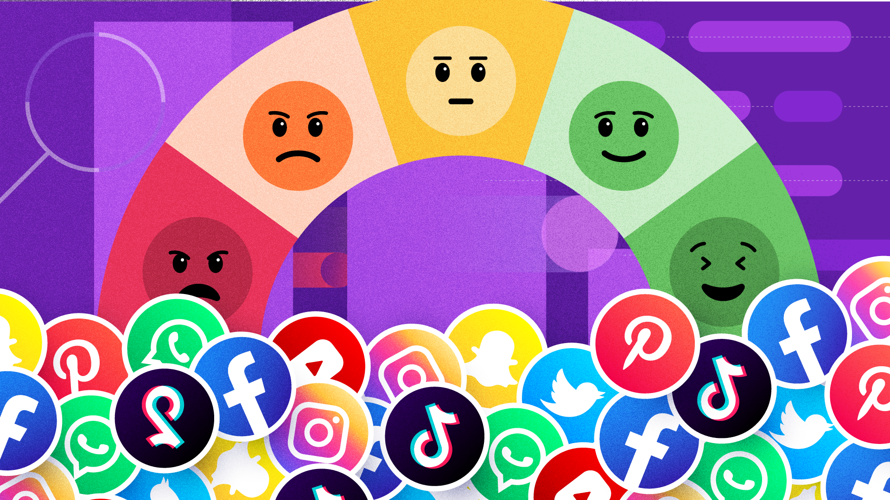

# README: Social Media Sentiment Analysis

## Group 3  
**Authors:**  
- Ibrahim Salim  
- Abond Mwangi  
- Abigail Muthenya  
- Nelson Kamau  

---

## 1.0 Introduction

Social media has become one of the most influential spaces for customers to express opinions and engage with brands. Platforms like Twitter produce a continuous stream of text data reflecting real-time public sentiment. This provides companies with valuable insight but also presents a major challenge in terms of manual monitoring and analysis.

This project focuses on automatically analyzing the sentiment of tweets directed at brands using Natural Language Processing (NLP) techniques.

---

## 2.0 Problem Statement

Manually tracking customer sentiment across thousands of tweets is not scalable. Brands often miss critical feedback that could protect their reputation or inform marketing decisions. The objective of this project is to create a machine learning pipeline that accurately classifies tweet sentiment into four categories:

- Positive  
- Negative  
- Neutral  
- Irrelevant  

This model will help companies better understand public perception and react accordingly.

---

## 3.0 Data Description

### Datasets:
- `twitter_training.csv`: Used for training the model
- `twitter_validation.csv`: Used for evaluating the model

Each dataset contains:
- Brand name (e.g., Amazon, Facebook)
- Sentiment label (Positive, Negative, Neutral, Irrelevant)
- The raw tweet text

### Preprocessing:
- Removal of noisy content (URLs, mentions, emojis)
- Conversion to lowercase
- Tokenization and lemmatization
- Stopword and punctuation removal

These steps were essential for converting raw, unstructured text into a clean format ready for vectorization and modeling.

---

## 4.0 Exploratory Data Analysis (EDA)

EDA was performed to understand the characteristics and patterns within the dataset:
- Frequency distribution of sentiment labels
- Brand-specific sentiment trends
- Commonly used words for each sentiment class

Visualizations used include:
- Bar plots for class balance
- Word clouds for textual patterns
- Pie charts for sentiment breakdown by brand

These insights helped guide the modeling approach and highlight potential class imbalance issues.

---

## 5.0 Feature Engineering

To convert text data into a numerical format suitable for machine learning, we used:

- **TF-IDF Vectorization**: Captures the importance of words across documents while down-weighting common words.
- **N-grams**: Included unigrams and bigrams to capture word context.
- **Label Encoding**: Converted target sentiment labels into numeric form.

This feature engineering helped improve model performance by providing context-aware representations of tweets.

---

## 6.0 Model Building

We evaluated a variety of supervised classification models to predict sentiment labels:

### Models Tried:
- **Logistic Regression**  
- **Multinomial Naive Bayes**  
- **Support Vector Machine (SVM)**  
- **Random Forest Classifier**

Each model was trained using 80% of the data and validated on the remaining 20% using cross-validation.

### Evaluation Metrics:
- **Accuracy**: Overall correctness
- **Precision**: How many predicted positives are actual positives
- **Recall**: How many actual positives were captured
- **F1 Score**: Harmonic mean of precision and recall
- **Confusion Matrix**: Breakdown of predictions by class

---

## 7.0 Validation & Testing

The validation dataset (`twitter_validation.csv`) was used to evaluate model generalizability. Key outcomes include:

- **SVM and Logistic Regression** consistently delivered the highest performance.
- The models struggled slightly with distinguishing between **Neutral** and **Irrelevant** tweets due to semantic similarity.
- **Multinomial Naive Bayes** performed reasonably well but had lower recall on minority classes.

The final models demonstrated a balanced trade-off between accuracy and interpretability.

---

## 8.0 Results & Interpretation

- The best-performing model achieved a high **F1 score**, showing robustness across all sentiment classes.
- **Brand-specific analysis** revealed that brands like Facebook and Amazon receive more polarized sentiments.
- **Word frequency analysis** showed common triggers for positive or negative sentiment (e.g., "crash", "love", "slow", "update").

These findings demonstrate how NLP can uncover public opinion trends that are not obvious at first glance.

---

## 9.0 Key Takeaways

- Social media sentiment analysis provides real-time feedback for businesses.
- A well-designed NLP pipeline can replace hours of manual sentiment classification.
- Text preprocessing plays a critical role in improving model accuracy.
- The choice of vectorization (TF-IDF with n-grams) significantly impacts classification performance.

Business stakeholders can use these insights to:
- Monitor reputation
- Preempt PR crises
- Guide product improvement

---

## 10.0 Future Work

- **Model Deployment**: Convert the notebook into a web application using Streamlit for real-time sentiment classification.
- **Advanced NLP Models**: Implement transformer-based models like BERT to capture deeper linguistic patterns.
- **Multilingual Support**: Extend analysis to tweets in other languages to widen applicability.
- **Dashboard Integration**: Build a visualization dashboard for sentiment trends over time by brand and keyword.

These improvements will make the system more scalable and applicable in production settings.

---

## Tools and Technologies Used

| Category               | Tools/Libraries                        |
|------------------------|----------------------------------------|
| Data Handling          | pandas, numpy                          |
| NLP & Text Processing  | re, nltk                               |
| Visualization          | matplotlib, seaborn, wordcloud         |
| Modeling               | scikit-learn                           |
| Feature Engineering    | TF-IDF Vectorizer, N-grams             |
| Evaluation             | Accuracy, F1-score, Confusion Matrix   |
